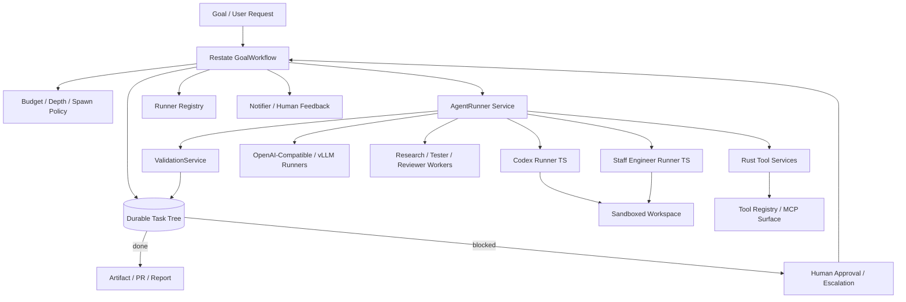

# Architecture

Joseph And The Amazing Technicolor Task Graph is a durable task-tree harness for agentic engineering work.

It follows three rules:

1. The coordinator owns global truth.
2. Workers return structured evidence.
3. Validation decides whether to continue, spawn, retry, block, or finish.



## Durable Coordinator

`crates/coordinator` exposes a Restate workflow named `GoalWorkflow`.

Handlers:

- `run(goal: GoalSpec) -> GoalState`
- `cancel(reason: String) -> String`
- `inject_feedback(feedback: HumanFeedback) -> String`
- `approve(approval: HumanApproval) -> String`
- `status() -> Option<GoalState>`

The current implementation executes a bounded durable frontier loop with stub workers. It persists `GoalState` after every meaningful transition. Live worker adapters can replace the stub `AgentRunner` without changing the domain contracts.

## Domain Contracts

`crates/domain` is the stable contract layer. It defines:

- Goal and task state: `GoalSpec`, `GoalState`, `TaskNode`, `TaskStatus`
- Execution policy: `Budget`, `SpawnPolicy`, `SandboxProfile`, `DoneCriteria`
- Worker I/O: `AgentRunRequest`, `AgentRunResult`, `ChildTaskRequest`
- Validation I/O: `ValidationRequest`, `ValidationReport`
- Human gates: `HumanFeedback`, `HumanApproval`, `ApprovalRequest`
- Distributed execution: `ExecutionProfile`, `RunnerSelector`, `RunnerRegistration`, `ModelRoute`, `PersonaSpec`
- MCP and auth references: `McpContextRef`, `McpServerRef`, `SecretRef`
- Notifications: `NotificationPolicy`, `NotificationRequest`, `NotificationDeliveryReport`

Schemas are generated with:

```sh
cargo run -p jattg-domain --bin generate-schemas -- schemas
```

## Worker Boundaries

Codex worker:

- Prefer Codex App Server for rich local agent control.
- Use Codex MCP when the coordinator or OpenAI Agents SDK needs Codex as a callable tool.
- Keep thread IDs, sandbox profiles, and artifacts in the worker result.

Staff-engineer worker:

- Verify `@ctxr/kit` and `@ctxr/agent-staff-engineer` before live execution.
- Treat it as an issue-to-PR lifecycle worker.
- Preserve human gates for merge and tracker Done.

Rust tool workers:

- Expose deterministic repo, test, artifact, and policy tools through the tool registry.
- Keep side effects behind sandbox and approval policy checks.

## Distributed Runners And Model Routing

Tasks do not assume a local runner. `TaskNode.execution` declares:

- required runner role, capabilities, labels, locality, and optional runner ID;
- ordered model candidates, including OpenAI, OpenAI-compatible, vLLM, Ollama, llama.cpp, Hugging Face, Codex, or local-process models;
- task-local persona;
- MCP servers and secret references;
- notification events and targets.

Runners register with `jattg-runner-registry` using `RunnerRegistration`. The registry matches task execution profiles against runner roles, capabilities, labels, and available models. This supports separate nodes, GPU pools, local vLLM endpoints, cheap/fast local models, and higher-quality fallback routes.

## MCP Context And Auth

MCP context is distributed as references:

- `McpServerRef` names the server, transport, URI, allowed tools, and auth mode.
- `SecretRef` names where auth material lives, without copying the token into task state.
- `McpContextPropagation` decides whether the coordinator issues context, the runner resolves references, or workload identity is used.

The runner receives enough information to connect to MCP tools, but secret material stays in env vars, Kubernetes Secrets, Vault, cloud secret stores, workload identity, or OAuth delegation.

## Notifications And Feedback

`NotificationPolicy` is part of every task execution profile. The notifier service can route approval requests, human-feedback requests, blocked tasks, failures, budget warnings, and completions to a thread, webhook, Slack, email, tracker, or paging system. Restate shared workflow handlers still own durable `approve` and `inject_feedback` signals.

## Deployment Shape

Compose runs Restate, the Rust services, both TypeScript sidecars, the runner registry, the notifier, and OpenTelemetry.

Kubernetes uses separate Deployments for long-lived services and leaves room for per-task sandbox Jobs. ConfigMaps hold non-secret config. Secrets hold agent tokens and tracker credentials.

## Failure Model

- Transient worker failures retry through Restate service calls.
- Terminal policy failures become blocked or failed task states.
- Budget exhaustion terminates the workflow.
- Approval waits are represented as task state and shared workflow signals.
- Workers can request children but cannot mutate the task tree directly.
