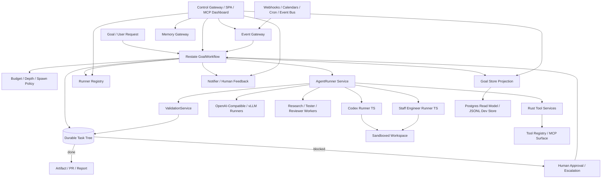

# Architecture

Joseph and the Amazing Technicolor Task Graph is a durable task-tree harness for agentic engineering work. `coat` is the short operational slug for commands, package names, environment variables, service images, and deployment names.

It follows three rules:

1. The coordinator owns global truth.
2. Workers return structured evidence.
3. Validation decides whether to continue, spawn, retry, block, or finish.



## Durable Coordinator

`crates/coordinator` exposes a Restate workflow named `GoalWorkflow`.

Handlers:

- `run(goal: GoalSpec) -> GoalState`
- `cancel(reason: String) -> String`
- `inject_feedback(feedback: HumanFeedback) -> String`
- `approve(approval: HumanApproval) -> String`
- `status() -> Option<GoalState>`
- `progress() -> Option<GoalProgress>`
- `tasks(query: TaskQuery) -> Option<TaskList>`

The current implementation executes a bounded durable frontier loop and dispatches agent tasks through the runner registry. Local development can fall back to a stub result when no compatible runner is registered; production should disable that fallback so unmatched work blocks and notifies a human.

When `COAT_GOAL_STORE_URL` is set, the coordinator projects `GoalState` snapshots into `coat-goal-store` inside named durable Restate steps. Restate remains authoritative; the goal store is a queryable read model for dashboards, operators, audit, and cross-goal reporting. Set `COAT_GOAL_STORE_REQUIRED=true` only when projection durability should block workflow progress.

Clean goals include `GoalPlan.subgoals` and `initial_tasks` with stable `subgoal_id`s. `GoalState::new` materializes those initial tasks as children under the root planner task, so known work is immediately dispatchable while the root keeps ownership of the global plan. Operators and coordinators use `TaskQuery` to find subgoals by ID, role, status, purpose, tag, or runnable frontier.

## Domain Contracts

`crates/domain` is the stable contract layer. It defines:

- Goal and task state: `GoalSpec`, `GoalState`, `TaskNode`, `TaskStatus`
- Goal planning and progress: `GoalAuthoringGuidance`, `GoalPlan`, `SubgoalSpec`, `GoalQualityReport`, `GoalProgress`, `TaskQuery`, `TaskList`
- Execution policy: `Budget`, `SpawnPolicy`, `SandboxProfile`, `ApprovalGatePolicy`, `DoneCriteria`
- Worker I/O: `AgentRunRequest`, `AgentRunResult`, `ChildTaskRequest`
- Validation I/O: `ValidationRequest`, `ValidationReport`
- Human gates: `HumanFeedback`, `HumanApproval`, `ApprovalRequest`
- Distributed execution: `ExecutionProfile`, `RunnerSelector`, `RunnerRegistration`, `ModelRoute`, `PersonaSpec`
- Result channels: `ResultChannelPolicy`, `GitResultPolicy`, `GitResultRef`, `ObjectStoragePolicy`, `ObjectStoreRef`, `ObjectStorageArtifactRef`
- Goal store projection: `GoalStorePolicy`, `GoalRecord`, `TaskRecord`, `GoalEventRecord`, `GoalStoreSnapshot`
- Review and satisfaction: `ReviewPolicy`, `ReviewRound`, `SatisfactionReport`, `LearningSignal`
- MCP and auth references: `McpContextRef`, `McpServerRef`, `SecretRef`
- Notifications: `NotificationPolicy`, `NotificationRequest`, `NotificationDeliveryReport`

Schemas are generated with:

```sh
make schemas
```

Protobuf contracts are maintained with Buf:

```sh
buf lint
```

`proto/coat/v1/common.proto` owns shared protocol types, `goal_store.proto` owns queryable durable projections, and `runner.proto` owns runner and registry envelopes. Full Rust domain payloads are carried as JSON-schema envelopes so the protocol keeps typed indexes without forcing two divergent domain models.

## Documentation Cross-References

Architecture should be discoverable from both docs and code:

- `docs/README.md` is the documentation map and reading order.
- Each Rust service crate and TypeScript sidecar starts with a purpose header and architecture references.
- Public cross-service contracts in `crates/domain` carry doc comments when they affect state, routing, auth, validation, or satisfaction.
- `scripts/coat-doc-gardener.sh` checks for required source-of-truth docs and architecture-reference headers.

When a service boundary or public contract changes, update the relevant design doc, execution plan, generated schema, and entrypoint header in the same change.

## Control Gateway And Dashboards

`ui/control-plane-web` is an optional TypeScript gateway and SPA for operators and agent/chat clients. It composes backend APIs for visibility and steering:

- Restate workflow handlers for goal submit, status, progress, tasks, steering, approval, cancellation, restart, branch, and branch selection;
- `coat-goal-store` for goal, task, event, artifact, and projected prompt views;
- `coat-notifier` for human-feedback, approval, and async-response queues;
- `coat-event-gateway` for event sources, webhooks, calendar checks, cron-like triggers, and recent events;
- `coat-runner-registry` for runner capacity and routing visibility;
- `coat-memory-gateway` for semantic memory search, context packs, writes, joins, and repairs.

The gateway exposes `GET /` for the SPA, `/api/*` for dashboards, and `POST /mcp` for MCP-compatible tools such as `coat_overview`, `coat_goal_snapshot`, `coat_agent_activity`, `coat_human_threads`, `coat_steer_goal`, `coat_memory_search`, and `coat_event_sources`.

It is not a scheduler and must never write Restate state, goal-store projections, runner state, or memory stores directly. Browser edits become workflow signals, event-gateway calls, notification calls, or memory-gateway calls. Removing the gateway must not affect durable execution.

## Durable Planning Mode

Planning mode is a typed pre-goal workflow for chat-style planning. Operators can draft a `DurablePlan`, revise it across multiple human/agent turns, record open questions and decisions, and compile it into a `GoalSpec` when the plan is ready.

Planning mode lives in `coat-goal-store` because it is a durable operator artifact before Restate owns a submitted goal. The backend exposes:

- `POST /goal-store/plans`;
- `GET /goal-store/plans`;
- `GET /goal-store/plans/{plan_id}`;
- `POST /goal-store/plans/{plan_id}/revisions`;
- `POST /goal-store/plans/{plan_id}/compile`.

Compiling a plan returns a `GoalSpec` and quality report; it does not submit the goal. Submission remains explicit through `GoalWorkflow/run`.

## Goal Store And Durable Querying

The correct production database for goal-store interaction is Postgres unless an existing operational database already provides equivalent transactions, indexing, backups, access control, and observability. Use it as a read model, not the coordinator state machine:

- Restate: authoritative workflow state, replay, timers, retries, approval signals, child-task progression.
- Postgres: queryable goals, tasks, events, approvals, runner decisions, validation scores, and artifact refs.
- JSONB: exact `GoalState`, `TaskNode`, worker result, and validation payloads.
- pgvector: optional semantic search over operational records.
- Qdrant: default dedicated vector memory/RAG service.
- Graphiti/Zep: temporal semantic memory.
- S3-compatible storage: large artifacts.

Compose ships a local `coat-goal-store` service on `:9088` with JSONL replay for smoke tests. Production should replace the backend with Postgres while preserving the protobuf and JSON-schema contract surface. The operational DDL lives under `infra/db/migrations/`; Compose can start `pgvector/pgvector:pg16` through the optional `db` profile.

Dashboard reads can list all durable plans through `/goal-store/plans`, all projected goals through `/goal-store/goals`, and all projected task/agent rows through `/goal-store/tasks`. Current prompt visibility comes from `TaskRecord.payload_json.prompt`, which is the projected `TaskNode`; it is useful for inspection, but Restate workflow state remains authoritative after goal submission.

## Events, Webhooks, And Schedules

External events enter through `coat-event-gateway`, not workers. The gateway normalizes provider payloads into `ExternalEvent`, applies dedupe keys, evaluates `EventGoalRoute`, and then records, submits, or holds a `TriggeredGoalRequest`.

Supported event source shapes:

- webhooks and CloudEvents-compatible webhooks;
- calendar push notifications and bounded calendar pollers;
- cron and interval schedules;
- queues, Pub/Sub, GitHub/GitLab/Jira/Linear/Slack events, email, object storage, and Kubernetes events.

Kubernetes CronJobs are the cluster-native scheduled trigger path. Restate timers are for durable waits and follow-ups inside already-running workflows. Calendar watchers should store OAuth/session state in `SecretRef` and produce actionable calendar-window events rather than letting an agent loop poll a calendar forever.

Webhook auth is policy-driven. The local gateway supports no-auth, shared-secret headers, bearer tokens, and HMAC-SHA256 using `SecretRef`; mTLS and OIDC JWT should terminate at trusted ingress or a secret/auth broker until provider adapters are installed. AsyncAPI docs for these channels live at `docs/api/event-gateway.asyncapi.yaml`.

Agents may propose new monitors, schedules, or event routes as structured outputs, but activation should pass through coordinator policy and human approval when it adds external callbacks, calendar auth, cron jobs, or cost-bearing work.

## Worker Boundaries

Codex worker:

- Prefer Codex App Server for rich local agent control.
- Use Codex MCP when the coordinator or OpenAI Agents SDK needs Codex as a callable tool.
- Keep thread IDs, sandbox profiles, and artifacts in the worker result.

Staff-engineer worker:

- Verify `@ctxr/kit` and `@ctxr/agent-staff-engineer` before live execution.
- Treat it as an issue-to-PR lifecycle worker.
- Preserve human gates for merge and tracker Done.

Rust tool workers:

- Expose deterministic repo, test, artifact, and policy tools through the tool registry.
- Keep side effects behind sandbox and approval policy checks.

## Subagent Authority

In COAT, "subagent" is a control-plane word. It means a durable child
`TaskNode` created by the coordinator, queued through runner dispatch, and
validated like any other task. It does not mean a Codex, Claude Code, Agents
SDK, MCP client, or local model process may spawn hidden native subagents inside
one runner invocation.

`ExecutionProfile.subagents` is injected into runner contexts and defaults to:

- `mode = coordinator_durable_tasks`;
- `native_spawn = disabled`;
- `child_request_channel = AgentRunResult.child_requests`.

Workers can still ask for decomposition. They do it by returning
`ChildTaskRequest` objects. The coordinator then applies `SpawnPolicy`, budget,
approval policy, memory policy, MCP auth policy, sandbox policy, runner
selection, and model routing before any child work starts. The tool registry
and control gateway expose MCP tools that restate this policy for agent/chat
clients.

## Result Channels

Workers communicate durable results through structured refs. Code changes should use git worktrees and task branches, returning `AgentRunResult.git_result` with branch, worktree path, commit, push status, optional PR URL, and optional diff URI. Large outputs should use S3-compatible object storage, returning `AgentRunResult.object_artifacts` with bucket/key/URI/hash metadata.

Workers also return `AgentRunResult.checkpoints` for inspectable history: git branch/commit/tag checkpoints, workspace snapshots, object-store archives, metadata milestones, or external history refs. `CheckpointPolicy` controls whether checkpointing is disabled, manual, periodic, or automatic on result, and code tasks can require a checkpoint before validation passes.

The coordinator stores these refs and treats them as artifact evidence. It does not store full diffs, large generated files, checkpoint bundles, or object-store credentials in workflow state. Compose runs a local MinIO-compatible `object-store` for development; AWS/EKS deployments should point the same `ObjectStoreRef` contract at S3 and resolve credentials through workload identity or `SecretRef`.

## Approval Policies

Approval is evaluated before a runnable task is dispatched. `SandboxProfile.approval_policy` expresses the task-local posture (`never`, `on_request`, or `always`), while `GoalSpec.approval_policy` defines the control-plane risk rules. The default gate requests approval for open network, non-isolated runners, secret-bearing MCP contexts, dangerous MCP tools, privileged runner capabilities, any native subagent spawning policy, any `never` policy outside an isolated runner, and any `never` policy that lacks strong sandbox attestation.

When approval is required, the coordinator creates an `ApprovalRequest`, marks the task `waiting_approval`, stores notification delivery reports, and emits an `approval_requested` notification. `coat approve --goal-id ... --approval-id ...` updates durable state; accepted approvals resume the frontier loop, rejected approvals block the task.

## Distributed Runners And Model Routing

Tasks do not assume a local runner. `TaskNode.execution` declares:

- required runner role, capabilities, labels, locality, and optional runner ID;
- ordered model candidates, including OpenAI, OpenAI-compatible, vLLM, Ollama, llama.cpp, Hugging Face, Codex, or local-process models;
- task-local persona;
- MCP servers and secret references;
- notification events and targets.

Runners register with `coat-runner-registry` using `RunnerRegistration`. The bundled sidecars self-register and heartbeat when `RUNNER_REGISTRY_URL` is set; external workers can register through the CLI or direct HTTP. Sidecars expose `/capabilities` for roles, capacity, models, MCP propagation, and review-contract inspection.

Dispatch ranks eligible candidates and returns rejected runners with mismatch reasons. Matching evaluates runner role, capabilities, labels, locality, MCP availability, and model route strategy. This supports separate nodes, GPU pools, local vLLM endpoints, cheap/fast local models, weighted routing, sticky-per-goal routing, and higher-quality fallback routes.

Sandbox-capable runners advertise backend capabilities such as `gvisor_sandbox`, `kata_sandbox`, `firecracker_sandbox`, or `kubernetes_job_sandbox` and return `SandboxAttestation` evidence. Local workspace runners are trusted-development conveniences, not strong isolation. Production untrusted execution should route to hardened container, RuntimeClass, microVM, or provider-backed runner pools.

## MCP Context And Auth

MCP context is distributed as references:

- `McpServerRef` names the server, transport, URI, allowed tools, and auth mode.
- `SecretRef` names where auth material lives, without copying the token into task state.
- `McpContextPropagation` decides whether the coordinator issues context, the runner resolves references, workload identity is used, the task is runner-local only, or an OAuth/device broker is needed.
- `AuthDistributionPolicy` names allowed material kinds, required runner labels, lease TTL, renewal policy, and whether node-local device sessions or secret sync are allowed.

The runner receives enough information to connect to MCP tools, but secret material stays in env vars, Kubernetes Secrets, Vault, cloud secret stores, 1Password, Bitwarden, Doppler, SOPS material, workload identity, local device-session stores, or a broker. Device/browser sessions for Codex or Claude Code should be node-local by default: route to labelled runners such as `auth.codex.device=true` instead of copying login files. Brokered user auth uses short-lived leases and triggers a critical approval gate.

The Rust tool registry exposes a minimal HTTP MCP endpoint. It supports optional bearer auth through `MCP_TOOL_TOKEN`, lists available tools, confines `repo_status` to `TOOL_REGISTRY_WORKSPACE_ROOT`, and routes command execution requests back toward the sandbox runner instead of executing arbitrary commands.

## Review, Satisfaction, And Learning Signals

Actor work is not enough to complete a goal by default. Once work-like tasks are validated, the coordinator forks critic review tasks from the durable task tree. When the configured reviews pass, it joins them through a unification task. `GoalState.satisfaction` records whether actor work, review gates, unification, and score thresholds are satisfied.

Critic and unifier runners return `ReviewOutput`: decision, reward, findings, retry recommendation, and optional unification summary. Validation records that output in `ValidationReport`; satisfaction uses both reward and explicit decision, so `changes_requested`, `blocked`, or `inconclusive` cannot satisfy a goal.

Strict executor tasks can also enable `ExecutionProfile.guardrails`. When enabled, actor completion forks bounded output-safety and security-review tasks. Their findings and validation gates participate in the same satisfaction logic, so unsafe executor output cannot complete the goal merely because the actor returned artifacts.

This is the bounded actor/critic loop:

- actor task produces artifacts;
- critic review task evaluates evidence and missing work;
- unifier task joins critic branches into one satisfaction decision;
- validation emits `LearningSignal` rewards for actor, critic, and unifier steps.
- if reward is below threshold, a bounded actor retry can be spawned and reviewed in a later round.

Retries remain explicit child tasks and are bounded by `SpawnPolicy`, budgets, and `ReviewPolicy`; there is no open-ended reinforcement loop inside the coordinator.

## Human Steering, Research, And Memory

The closest supported shape to an infinite loop is `ControlLoopMode::HumanSteeredContinuous`: the coordinator can stay receptive to steering, but every new action is a durable task with budgets, source requirements, and stop conditions.

Operators steer goals with `SteeringDirective`:

- add constraints;
- update the objective;
- inject bounded work;
- request sourced research;
- pause, resume, or cancel.

Research tasks return `ResearchOutput` with sources, confidence, open questions, and an `InformationUsePlan`. The plan tells downstream agents which facts to use, which facts to avoid, what task updates are proposed, and which validation checks should be added.

Goal authoring is an explicit preflight path. Use `coat goal lint` before submit to catch vague objectives, missing criteria, missing subgoals, missing initial task routing, unsafe budgets, or risky approval defaults. After submit, use `coat goal progress` for the durable progress summary and `coat goal tasks` to inspect or distribute subgoal work without giving workers control over the global task tree.

Default semantic memory is Zep/Graphiti over MCP plus Qdrant for embedded retrieval. Restate owns durable execution history. Zep/Graphiti owns temporal agent memory for facts, episodes, requirements, and changing relationships. Qdrant owns vector memory and RAG retrieval over reviewed memory episodes, source chunks, and durable knowledgebase records. Forked tasks inherit memory context by reference, write branch-scoped memories, and promote shared memory only through critic or unifier-curated joins.

`coat-memory-gateway` is the stable local control-plane interface for memory. It exposes REST and MCP-shaped `memory_write`, `memory_search`, `memory_context`, `memory_join`, `memory_repair`, and `memory_events` tools. The scaffold stores records in memory and can replay an append-only JSONL journal when `MEMORY_GATEWAY_JOURNAL_PATH` is set. When `MEMORY_GATEWAY_GRAPHITI_MCP_URL` is configured, the gateway mirrors writes, searches, and fork/join summaries to Graphiti with `add_episode`, `search_nodes`, and `search_facts`. When `MEMORY_GATEWAY_QDRANT_URL` and `MEMORY_GATEWAY_EMBEDDING_URL` are configured, it also writes embeddings into Qdrant and merges vector hits into `memory_search`. `memory_context` turns scoped retrieval into a bounded task context pack with an `InformationUsePlan`. Adapter failures are reported in `adapter_reports`, do not roll back local memory, and can be repaired later from local records.

## Notifications And Feedback

`NotificationPolicy` is part of every task execution profile. The notifier service can route approval requests, human-feedback requests, blocked tasks, failures, budget warnings, and completions to a thread, webhook, Slack, email, tracker, or paging system. Restate shared workflow handlers still own durable `approve` and `inject_feedback` signals.

The scaffold notifier also keeps an in-memory thread ledger keyed by `feedback_thread_key`, explicit thread target, or goal ID. This gives local operators a way to inspect which human-feedback threads need attention while keeping durable truth in Restate.

## Deployment Shape

Compose runs Restate, the Rust services, both TypeScript sidecars, the runner registry, the notifier, and OpenTelemetry.

Kubernetes uses separate Deployments for long-lived services and leaves room for per-task sandbox Jobs. ConfigMaps hold non-secret config. Secrets hold agent tokens and tracker credentials.

## Failure Model

- Transient worker failures retry through Restate service calls.
- Terminal policy failures become blocked or failed task states.
- Budget exhaustion terminates the workflow.
- Approval waits are represented as task state and shared workflow signals.
- Workers can request children but cannot mutate the task tree directly.
