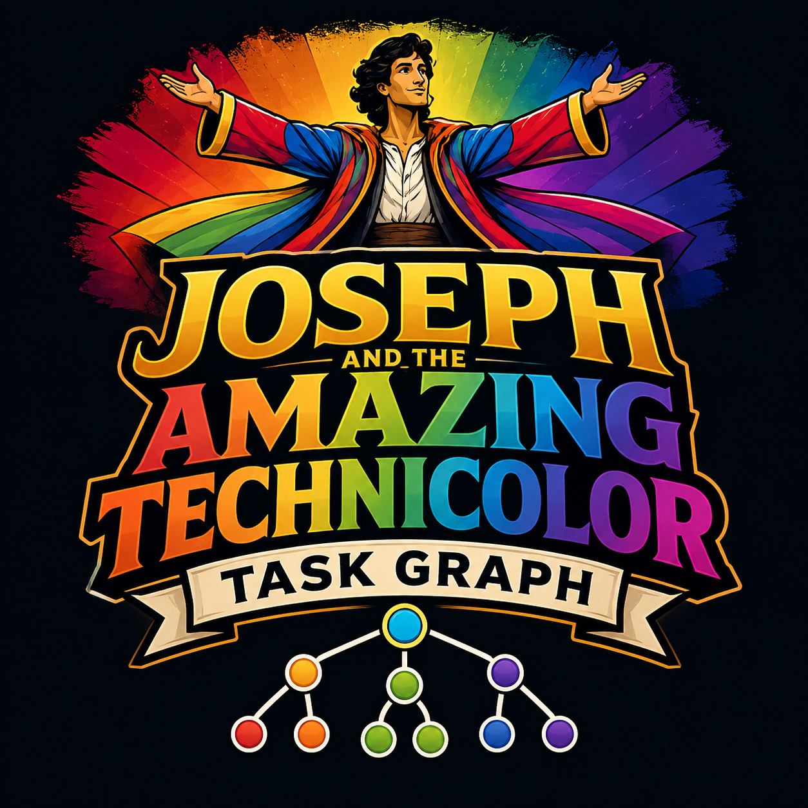

# Joseph and the Amazing Technicolor Task Graph



A durable task-tree control plane for long-running agentic engineering work.

`coat` is the short operational slug for commands, packages, environment variables, service images, and deployment names.

The core idea is simple: Restate owns durable time and replay, Rust owns policy and state, Codex owns bounded code execution, and specialized workers produce structured evidence for the coordinator to validate.

## Quick Start

The docs assume the `coat` CLI is installed and available on `PATH`.

```sh
make ci
cargo test --workspace
buf lint
make schemas
coat init
```

Run the local stack:

```sh
docker compose -f infra/compose/docker-compose.yml up --build
```

The optional web control surface is included in Compose at `http://localhost:9090`. It shows goal progress, agent/task state, current projected prompts, runner status, human feedback threads, event sources, schedules/triggers, and memory search/context. It also exposes a small MCP surface at `POST /mcp` for agent or chat clients.

Run the local services against Restate Cloud for personal durable use:

```sh
cp infra/compose/restate-cloud.env.example infra/compose/restate-cloud.env
# edit infra/compose/restate-cloud.env with env id, API key, region, and signing public key
docker compose \
  --env-file infra/compose/restate-cloud.env \
  -f infra/compose/docker-compose.yml \
  -f infra/compose/docker-compose.restate-cloud.yml \
  --profile restate-cloud \
  up --build
coat compose up --restate-cloud
coat restate register-cloud \
  --tunnel-name coat-personal \
  --service-url http://coordinator:9080
```

See `docs/operations/restate-cloud.md` for personal Restate Cloud, public endpoint, and Kubernetes operator paths.

Start the optional Postgres/pgvector operational store profile when you want SQL-backed dashboard and audit development:

```sh
docker compose -f infra/compose/docker-compose.yml --profile db up postgres
```

Submit a goal through Restate ingress. In local development, unmatched tasks can fall back to the local stub runner:

```sh
coat goal submit \
  --title "Smoke goal" \
  --objective "Prove the durable task tree can accept and validate a task"
```

For non-trivial work, author a full `GoalSpec` instead of relying on title/objective defaults:

```sh
coat plan draft \
  --title "Strict review goal plan" \
  --objective "Plan a bounded implementation with review doctrine before creating a GoalSpec." \
  --prompt "Capture questions, decisions, subgoals, and first tasks before agents execute."
coat plan list
coat plan compile \
  --plan-id <plan-id> \
  --strict-review \
  --human-steered \
  --out examples/drafts/strict-review-goal.json
coat goal draft \
  --title "Strict review goal" \
  --objective "Implement a bounded change with typed review doctrine, sourced research, passing tests, regenerated schemas, and reviewer acceptance." \
  --strict-review \
  --human-steered \
  --out examples/drafts/strict-review-goal.json
coat goal lint --file examples/goal-clean-plan.json --strict
coat goal submit --file examples/goal-template-structured.json
coat goal progress --goal-id 018f8f2f-1fd8-7688-bb12-8bfb6b756611
coat goal tasks \
  --goal-id 018f8f2f-1fd8-7688-bb12-8bfb6b756611 \
  --file examples/task-query-subgoal.json
```

See `docs/operations/goal-authoring.md` for the intake, memory preflight, research preflight, compiler, and critic loop used to turn vague operator requests into structured goals.
Use `docs/design-docs/120-durable-planning-mode.md` when the request needs a chat-style planning session before it becomes a durable goal.

Strict goals can opt in to a review-doctrine standard library for code quality, testing, formal-methods, DDD/functional-DDD, style, and simplicity checks:

```sh
coat goal review-checks
coat goal lint --file examples/goal-review-doctrine.json --strict
coat goal steer-standard \
  --goal-id 018f8f2f-1fd8-7688-bb12-8bfb6b756800 \
  --check deep_research \
  --topic "state-of-the-art libraries and review doctrine"
```

The doctrine library is typed and extensible: use built-in presets, add custom objectives/evidence/gates/subagents, and apply overrides per goal. See `docs/design-docs/090-review-doctrine-stdlib.md`.

Goals also carry restart, timeout, and branch-competition policy. Operators can restart a blocked/timed-out goal without creating a new workflow, branch a goal or subgoal into multiple candidate implementations, and select the winning branch after reviewer/tester votes:

```sh
coat goal submit --file examples/goal-branching-competition.json
coat goal branch \
  --goal-id 018f8f2f-1fd8-7688-bb12-8bfb6b756700 \
  --file examples/branch-request-root.json
coat goal select-branch \
  --goal-id 018f8f2f-1fd8-7688-bb12-8bfb6b756700 \
  --file examples/branch-selection.json
coat goal restart \
  --goal-id 018f8f2f-1fd8-7688-bb12-8bfb6b756700 \
  --file examples/restart-request-task.json
```

## Services

- `coat-coordinator`: Restate workflow, distributed runner handoff, local stub fallback, validation handler.
- `coat-event-gateway`: webhook, calendar, scheduled-event, and triggered-goal ingress.
- `coat-goal-store`: queryable goal/task/event projection with local JSONL replay.
- `coat-plan-store`: durable planning-mode records served by `coat-goal-store`.
- `coat-runner-registry`: distributed runner registration, heartbeat, and task dispatch decisions.
- `coat-notifier`: notification, local human-feedback threads, and webhook delivery adapter.
- `coat-memory-gateway`: local memory write/search/join/events gateway with MCP-shaped tools.
- `coat-control-web`: optional TypeScript control gateway, SPA, and MCP dashboard surface.
- `coat-validator`: standalone validation service.
- `coat-sandbox-runner`: workspace lifecycle, launch-plan, attestation, and content-addressed snapshot service.
- `coat-tool-registry`: HTTP and MCP-shaped tool registry with confined repo status, sandbox delegation, and artifact lookup.
- `coat`: operator CLI, built from the `coat-cli` package.
- `codex-runner-ts`: Codex App Server or MCP worker boundary.
- `staff-engineer-runner-ts`: `@ctxr/agent-staff-engineer` worker boundary.
- `object-store`: local S3-compatible artifact store for large task outputs.

## Releases

Release packaging and version bumps are documented in `docs/operations/releases.md`. Use `coat release plan --version ...` to preview binary and chart tags, and `coat release bump --version ...` to update `Cargo.toml` plus the Helm chart metadata.

GitHub publishes binaries and Helm charts through separate workflows:

- `.github/workflows/release-binaries.yml` on tags like `v0.2.0`;
- `.github/workflows/release-helm.yml` on tags like `chart-v0.2.0`.

## Protocols And Goal Store

Buf-managed protobuf contracts live under `proto/coat/v1`.

```sh
buf lint
```

The coordinator keeps Restate workflow state authoritative, then projects typed snapshots into the goal store through durable `ctx.run` steps. Local Compose uses `coat-goal-store` with a JSONL journal on `:9088` by default. The same service can run with `COAT_GOAL_STORE_BACKEND=postgres` and `COAT_GOAL_STORE_DATABASE_URL=postgres://...`; in that mode it writes the standard Postgres read model, stores full protocol records in JSONB, and keeps indexed columns for goal/task/event/operator queries.

Postgres migrations live under `infra/db/migrations/`. They cover goals, tasks, goal events, approvals, artifacts, event inbox/outbox records, and an optional `pgvector` memory index.

Run the Postgres projection locally with:

```sh
COAT_GOAL_STORE_BACKEND=postgres \
  docker compose -f infra/compose/docker-compose.yml --profile db up postgres goal-store
```

Inspect the projection surface:

```sh
coat store policy
coat store goals
coat store plans
coat store approvals --limit 50
coat store goal --goal-id 018f8f2f-1fd8-7688-bb12-8bfb6b756611
coat store tasks --goal-id 018f8f2f-1fd8-7688-bb12-8bfb6b756611
coat store events --goal-id 018f8f2f-1fd8-7688-bb12-8bfb6b756611
coat store checkpoints --goal-id 018f8f2f-1fd8-7688-bb12-8bfb6b756611
coat store goal-approvals --goal-id 018f8f2f-1fd8-7688-bb12-8bfb6b756611
coat store record-artifacts --file examples/goal-store-record-artifacts.json
```

The web gateway reads the same projection surface. It uses global goal and task lists for dashboard views, and per-goal snapshots combine `GoalWorkflow/status`, `GoalWorkflow/progress`, tasks, events, artifacts, and `TaskRecord.payload_json.prompt` for agent prompt visibility.

Durable planning mode is stored in the same service:

```sh
coat plan draft --file examples/plan-draft-durable-mode.json
coat plan revise --plan-id <plan-id> --file examples/plan-revision-answer-questions.json
coat plan compile --plan-id <plan-id> --strict-review --human-steered
```

Plans are versioned drafts. Compiling returns a `GoalSpec`; it does not submit the goal.

## Events And Schedules

External events enter through `coat-event-gateway` on `:9089`. Generic JSON events, webhooks, CloudEvents-style payloads, calendar checks, queue messages, and cron jobs are normalized into `ExternalEvent`, deduped, and routed through `TriggeredGoalRequest`. They create or steer goals through Restate instead of invoking workers directly.

```sh
coat event register --file examples/event-source-calendar-schedule.json
coat event register --file examples/event-source-webhook-hmac.json
coat event register --file examples/event-source-generic-ci.json
coat event register \
  --file examples/event-source-webhook-hmac.json \
  --approval-id approval-123
coat event ingest --file examples/external-event-calendar.json
coat event emit --source-id ci-events --file examples/generic-event-ci-failed.json
coat event trigger --file examples/triggered-goal-webhook.json
coat event triggers
```

Generic sources are the default adapter for CI, git, issue tracker, chat, monitoring, database-change, memory, runner, and agent-topology events before a provider-specific adapter exists. Webhook sources can require shared-secret headers, bearer tokens, or HMAC-SHA256 signatures with secrets resolved from `SecretRef`; production-only providers such as mTLS or OIDC JWT should be terminated by ingress or secret middleware until a provider adapter is installed. Use Kubernetes CronJobs for cluster scheduled triggers, provider push APIs or bounded pollers for calendars, and Restate timers for durable waits inside a running goal. Agent-proposed monitors or schedules should be reviewed and installed as event sources, not self-started by workers.

The public event contract is documented in `docs/api/event-gateway.asyncapi.yaml`. Kubernetes examples for a suspended scheduled trigger and optional pgvector-backed Postgres live under `infra/k8s/examples/`.

## Distributed Runners

Each durable task has an execution profile with runner selection, model candidates, persona, MCP context refs, timeout budget, result channels, and notification policy.

Subagents are durable COAT child tasks. Runner contexts, skills, MCP clients, Codex, Claude Code, and local model adapters should treat the word "subagent" as `AgentRunResult.child_requests`, not as native in-process agent spawning. The coordinator owns the durable queue, budget checks, approvals, routing, memory context, and sandbox policy for every requested child. See `docs/operations/runner-context-initialization.md`.

Example local vLLM runner registration:

```sh
coat runner register --file examples/runner-vllm.json
coat runner list
coat runner status
coat runner dispatch --file examples/dispatch-smoke.json
```

The bundled Codex and staff-engineer sidecars auto-register when `RUNNER_REGISTRY_URL` and `RUNNER_ENDPOINT` are set, which Compose and Kubernetes do by default.

Dispatch returns ranked candidates and rejected runners with reasons. Model routes can prefer first available, lowest latency, lowest cost, highest quality, weighted, or sticky-per-goal selection across Codex, hosted, and local OpenAI-compatible providers.

Branch competition uses the same routing layer: candidate tasks can use different personas, runner labels, or model routes, then branch-vote tasks and an optional unifier choose one implementation. The coordinator owns the branch group and selection record; workers only return structured evidence and votes.

Model and executor clusters are described in `docs/operations/model-runner-clusters.md`, including GB10/DGX Spark nodes, Mac mini runners, vLLM, Ollama, embedding services, and mixed sandbox fleets. Runners should register real capabilities and labels instead of relying on prompt convention.

Sidecars expose `/capabilities` for operator inspection and `/verify` for non-mutating dependency checks. The response includes roles, model candidates, MCP propagation support, subagent delegation policy, active capacity, review-contract support, and live-mode readiness without exposing secret values.

When `COAT_MEMORY_GATEWAY_URL` is set, sidecars call `memory_context` before `/run-task` work and include a `memory_context` artifact plus redacted diagnostics in `AgentRunResult`. Context lookup failures do not fail the task; they are reported as diagnostics so a coordinator, reviewer, or operator can decide whether to continue, research, or repair memory adapters.

MCP auth is passed by reference, not by value. Runners resolve `SecretRef` entries from their local environment, Kubernetes, Vault, cloud secret stores, 1Password, Bitwarden, Doppler, SOPS material, workload identity, or an external broker. Device/browser logins such as Codex or Claude Code should normally be `runner_local_only` and constrained by runner labels; distributed user auth should use a brokered short-lived lease plus approval.

The default MCP access mode is `single_user`. Multi-user OIDC is opt-in: set `McpContextRef.access_mode=multi_user_oidc`, include a `UserPrincipalRef`, configure `OidcDelegationPolicy`, and route only to runners advertising `oidc_user_delegation` plus tenant/user labels. MCP servers authenticate as the user through short-lived brokered OIDC access tokens or leases; raw user tokens never enter task state. See `docs/design-docs/130-multi-user-oidc-mcp.md` and `examples/mcp-context-multi-user-oidc.json`.

The tool registry exposes `/mcp` and requires `Authorization: Bearer ...` whenever `MCP_TOOL_TOKEN` is configured. Its `subagent_policy` tool returns the same durable-child-task rule for MCP clients. The control gateway exposes `coat_subagent_policy` for chat and dashboard surfaces.

The notifier records local in-memory feedback threads. Operators can inspect them with:

```sh
coat notify --threads
coat notify --thread-key local-model-coding-smoke
```

## Control Gateway And SPA

`ui/control-plane-web` is an optional TypeScript gateway and browser UI. It composes existing backend APIs; it does not dispatch workers or mutate durable state directly.

Use it for durable plan drafting/revision/compilation, goal submission, status, progress, steering, approval, cancellation, restart, branch selection, global and per-goal agent/task progress, projected prompts from `TaskNode.payload_json`, runner status, event sources, triggers, recent events, projected approval queues, notification threads, and memory operations.

Set `COAT_CONTROL_GATEWAY_TOKEN` for `/api/*` bearer auth and `COAT_CONTROL_MCP_TOKEN` for `/mcp`. See `docs/design-docs/110-control-gateway-spa.md`.

## Result Channels

Workers report durable result locations through `AgentRunResult.git_result`, `AgentRunResult.object_artifacts`, and `AgentRunResult.checkpoints`. Use git worktrees and task branches for source changes; use S3-compatible object storage for large generated outputs such as simulation runs, traces, datasets, screenshots, or reports; use checkpoints for reviewable task history such as branch milestones, commits, tags, workspace snapshots, object archives, or metadata markers. The coordinator stores refs, not large blobs or credentials.

The goal store exposes checkpoint history at `/goal-store/goals/{goal_id}/checkpoints`; the control gateway includes it in goal snapshots and exposes `coat_checkpoint_history` over MCP.

Compose starts MinIO as `object-store` and initializes the `coat-artifacts` bucket. Kubernetes includes the same development object-store deployment; AWS/EKS should use real S3 by setting the `ObjectStoreRef` endpoint/region/bucket and resolving auth with workload identity or `SecretRef`.

## Review Gate

Goals use a bounded actor/critic review gate by default. Actor work must validate, critic review tasks fork from completed work, and a unifier joins the critic branches before `GoalState.satisfaction.satisfied` becomes true. If the reward score is too low, the coordinator can spawn a bounded actor retry and review it in a later round. Validation scores are kept as `LearningSignal` records for future routing and policy tuning.

Critics return structured `ReviewOutput` with a decision, reward, findings, and retry recommendation. A non-accept decision blocks satisfaction even if the numeric reward is high.

## Steering, Research, And Memory

Goals carry `control_policy`, `research_policy`, and `memory_policy`. Operators can steer a running goal by submitting `SteeringDirective` JSON:

```sh
coat goal steer \
  --goal-id 018f8f2f-1fd8-7688-bb12-8bfb6b756602 \
  --file examples/steering-request-research.json
```

Research tasks must return `ResearchOutput`: answer, sources, confidence, open questions, and an `InformationUsePlan` that tells the coordinator how to apply gathered information.

Clean goals carry `authoring` notes and a `plan` with stable subgoal IDs. `initial_tasks` are now materialized as child `TaskNode`s under the root planner task, so the coordinator can dispatch known work immediately while preserving the root as global planner. Use `coat goal progress` for a durable progress summary and `coat goal tasks` to find tasks by subgoal, role, status, purpose, tag, or runnable frontier.

Approval gates are task-local but governed by `GoalSpec.approval_policy`. Dangerous tasks move to `waiting_approval`, send an `approval_requested` notification, and resume when approved:

```sh
coat approve \
  --goal-id 018f8f2f-1fd8-7688-bb12-8bfb6b756602 \
  --approval-id <approval-request-id> \
  --approved true
```

The default memory substrate is hybrid: Zep/Graphiti exposed as an MCP memory server for temporal agent memory, plus Qdrant for embedded memory and RAG retrieval. Restate remains the durable workflow journal; Postgres/pgvector can be added as a queryable operational audit index when SQL joins and vector search should live together. `docs/design-docs/030-distributed-memory-knowledgebases.md` explains when to use FalkorDB, Neo4j, pgvector, Qdrant, LanceDB, or Tantivy.

Local memory gateway commands:

```sh
coat memory write --file examples/memory-write-fact.json
coat memory search --file examples/memory-search.json
coat memory context --file examples/memory-context.json
coat memory join --file examples/memory-join.json
coat memory repair --file examples/memory-repair.json
coat memory events --goal-id 018f8f2f-1fd8-7688-bb12-8bfb6b756602
```

Create a sandbox workspace through the CLI:

```sh
coat sandbox plan --file examples/sandbox-workspace-request-gvisor.json
coat sandbox create --file examples/sandbox-workspace-request.json
coat sandbox create --file examples/sandbox-workspace-request-gvisor.json
```

`SandboxProfile.isolation` can request local workspace, container, gVisor, Kata, Firecracker, Kubernetes Job, namespace-jail, or provider-backed execution. `sandbox plan` renders the launch contract that a real executor can consume; `sandbox create` stores it as `sandbox-launch-plan.json` beside the workspace manifest. Local Compose only attests metadata-only workspaces. Production runners should return enforced `SandboxAttestation` evidence and can require executor output/security guardrail reviews through `ExecutionProfile.guardrails`; see `docs/design-docs/100-strong-sandboxing-guardrails.md`.

Git result channels are metadata-only by default. To create real task worktrees, set `SANDBOX_ENABLE_LIVE_GIT_WORKTREES=true`, set `SANDBOX_APPROVED_GIT_REPO_ROOTS` to comma-separated local repo roots, and include `live_git_worktree.enabled=true` plus an approval ID in the sandbox request. This keeps branch/worktree communication available while preventing workers from creating worktrees against arbitrary repos.

Sandbox workspaces include `checkpoints/checkpoint-manifest.json`, and launch plans expose `COAT_CHECKPOINT_MANIFEST` so executors can append git-style or snapshot-style history refs without relying on prompt convention.

Set `MEMORY_GATEWAY_JOURNAL_PATH` to make the local gateway replay an append-only JSONL journal on startup. Compose enables this with the `memory-gateway-data` volume.

Compose also runs Qdrant and configures the gateway to use it as the vector memory service. Set `OPENAI_API_KEY` or `MEMORY_GATEWAY_EMBEDDING_TOKEN` to enable the default OpenAI embedding path, or point `MEMORY_GATEWAY_EMBEDDING_URL` at an OpenAI-compatible local embedding server such as Hugging Face TEI. Set `MEMORY_GATEWAY_GRAPHITI_MCP_URL=http://localhost:8000/mcp/` to mirror gateway writes/searches/joins into Graphiti through best-effort MCP calls. Adapter success or failure is returned in `adapter_reports` without blocking local durability.

## Documentation

- Architecture: `ARCHITECTURE.md`
- Documentation map: `docs/README.md`
- Product spec: `docs/product-specs/coat-v1.md`
- Goal authoring: `docs/operations/goal-authoring.md`
- Memory/research design: `docs/design-docs/020-memory-research-steering.md`
- Distributed memory and knowledgebases: `docs/design-docs/030-distributed-memory-knowledgebases.md`
- Auth distribution: `docs/design-docs/040-auth-distribution.md`
- Strong sandboxing and guardrails: `docs/design-docs/100-strong-sandboxing-guardrails.md`
- Control gateway and SPA: `docs/design-docs/110-control-gateway-spa.md`
- Durable planning mode: `docs/design-docs/120-durable-planning-mode.md`
- Model and runner clusters: `docs/operations/model-runner-clusters.md`
- Execution plans: `docs/exec-plans/active/`
- Operations: `docs/operations/`
- Agent guide: `AGENTS.md`
