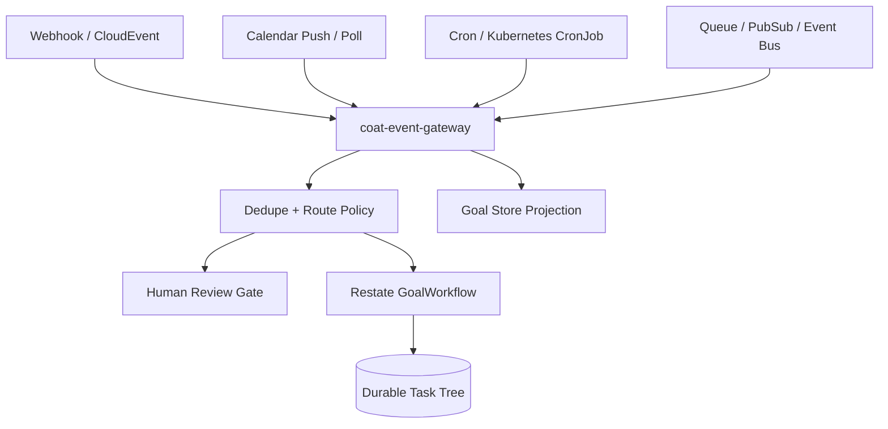

# Design Doc: Events, Webhooks, Calendars, And Schedules

External events should not call worker agents directly. They enter through `coat-event-gateway`, become normalized events with dedupe keys, and then create or steer durable goals through Restate.

## Decision

Use standard event and schedule shapes:

- CloudEvents-compatible metadata for webhook and bus events.
- Generic JSON event sources with JSON Pointer extraction for event id, type, subject, and dedupe keys.
- SQS-compatible queue sources for inbound event polling, using the normal AWS SDK credential chain and optional LocalStack/SQS-compatible endpoints.
- Provider-normalized observability sources for Prometheus Alertmanager, Datadog monitor webhooks, and OpenTelemetry-style operational signals.
- AsyncAPI for documenting event-driven APIs; the current contract lives at `docs/api/event-gateway.asyncapi.yaml`.
- Kubernetes CronJobs for cluster-native scheduled trigger jobs.
- Restate timers and workflows for durable waits, retries, approval pauses, and follow-up scheduling inside a running goal.
- Provider-specific push APIs for calendars where available, plus bounded polling for calendar windows and missed notifications.

`coat-event-gateway` is the ingress service. It records event sources, raw events, and triggered-goal decisions in an append-only JSONL journal for local development, or in the Postgres event inbox/outbox when `COAT_EVENT_GATEWAY_BACKEND=postgres`. High-volume channels can still be bridged through Kafka, Redpanda, NATS, SQS/SNS, Pub/Sub, EventBridge, or another existing event bus. Inbound SQS queues are polled through an explicit gateway endpoint, not by hidden worker loops. The Postgres schema lives in `infra/db/migrations/002_event_gateway.sql`.

## Topology



## Contracts

Core domain types:

- `EventSource`
- `WebhookEventSource`
- `GenericEventSource`
- `SqsEventSource`
- `ScheduledEventSource`
- `CalendarEventSource`
- `ExternalEvent`
- `EventGoalRoute`
- `GoalTriggerTemplate`
- `TriggeredGoalRequest`
- `TriggeredGoalResponse`

Proto definitions live in `proto/coat/v1/eventing.proto`.

`EventGoalRoute.mode` decides whether an event is recorded only, creates a goal, creates a research goal, steers an existing goal, or waits for human review. Routes must carry dedupe windows and may require approval.

## Webhook Rules

Webhook handlers should:

- verify gateway auth before recording or triggering work;
- verify source auth through `WebhookAuthPolicy`;
- support shared-secret headers, bearer tokens, and HMAC-SHA256 signatures with secret values resolved from `SecretRef`;
- use provider HMAC presets for GitHub (`x-hub-signature-256`), Slack Events (`x-slack-signature` over `v0:{timestamp}:{body}`), and Stripe-style webhooks (`Stripe-Signature` over `{timestamp}.{body}`);
- terminate production-only mTLS or OIDC JWT flows at trusted ingress or secret middleware until a provider adapter is installed;
- normalize headers and payload into `ExternalEvent`;
- normalize GitHub, GitLab, Slack Events, Stripe-style, Jira, and Linear payloads into provider-prefixed event types plus stable IDs, subjects, and dedupe keys;
- preserve provider delivery IDs as `dedupe_key`;
- never put raw shared secrets into event payloads, diagnostics, goal JSON, artifacts, or memory;
- create goals only through the event gateway and Restate ingress.

Provider-specific webhook adapters map delivery metadata into CloudEvents-style fields: `id`, `source_id`, `event_type`, `subject`, `occurred_at`, and payload. The local gateway includes first-pass adapters for GitHub, GitLab, Slack Events, Stripe-style, Jira, Linear, Prometheus Alertmanager, and Datadog monitor payload shapes; deeper provider integrations should build on those adapters instead of reimplementing auth.

## Activation Approvals

Risky enabled sources can create goals, steer goals, or send events into human review. In production-like configurations, set `COAT_REQUIRE_EVENT_SOURCE_APPROVAL=true`; the gateway then requires `x-coat-approval-id` or `coat event register --approval-id ...` when registering a risky source as enabled.

When `COAT_GOAL_STORE_URL` is set, accepted activation references are projected as `EventSourceApprovalRecord`s through `POST /goal-store/event-source-approvals`. These records are ingress-scoped rather than goal-scoped, so dashboards and operators can audit who enabled a source without inventing a synthetic goal. Query them with `coat store event-source-approvals`.

## Generic Event Sources

Generic event sources let agents and outside systems respond to events that do not deserve a bespoke adapter yet: IDE/LSP diagnostics, CI results, PR test failures, git branch updates, issue tracker changes, chat commands, monitoring alerts, database change notifications, memory updates, runner heartbeats, or agent topology proposals.

Use this pattern:

1. Register an `EventSource` with `kind=generic`, `ide_lsp`, `ide_diagnostics`, `ci`, `ci_test_failure`, `git`, `branch_activity`, `pull_request`, `pull_request_review`, `issue_tracker`, `chat`, `monitoring_alert`, `database_change`, `agent_event`, `runner_event`, `goal_lifecycle`, or `memory_event`.
2. Configure `generic.allowed_event_types` and JSON Pointer fields such as `/id`, `/type`, `/subject`, and `/delivery_id`.
3. Emit raw JSON or CloudEvents-compatible JSON to `POST /events/generic/{source_id}`.
4. The gateway normalizes the payload into `ExternalEvent`, applies dedupe, and routes according to `EventGoalRoute`.

`POST /events` still accepts a fully normalized `ExternalEvent`; add `?route=true` when an operator or upstream bus wants the gateway to route the event from its registered source policy. `POST /events/generic/{source_id}` routes by default unless `?route=false` is set.

Use generic sources as the first integration boundary. Add provider-specific adapters only when auth, normalization, rate limiting, or schema validation is stable enough to justify a typed adapter.

## IDE, Branch, PR, And Test-Failure Signals

Human work-in-progress should be visible to the task graph without giving the
IDE or git host direct control over workers. IDE extensions, local file
watchers, git hooks, repository webhooks, and CI systems should send bounded
events into `coat-event-gateway`:

- `kind=ide_lsp` or `kind=ide_diagnostics` for LSP diagnostics, workspace
  diagnostics, type errors, and editor-reported compile feedback;
- `kind=branch_activity` or `kind=git` for branch pushes, local dirty-state
  changes, ready-for-review signals, and branch deletion;
- `kind=pull_request` or `kind=pull_request_review` for PR opened, updated,
  review-requested, review-comment, and human-review events;
- `kind=ci_test_failure` or `kind=ci` for workflow failures, required-check
  failures, flaky-test recurrences, and PR test failures.

The gateway normalizes IDE payloads into `payload._coat_ide` with provider,
workspace, repo, branch, commit SHA, URI, file path, language ID, diagnostic
counts, and max severity. It normalizes branch, PR, and CI payloads into
`payload._coat_change_activity` with provider, repo, branch, base branch, commit
SHA, actor, PR number/URL, workflow/run IDs, conclusion, failed-test count, and
details URL.

Use this data for routing and memory, not as an automatic permission to edit
code. Good patterns:

1. Record branch activity so dashboards and memory can correlate human work
   with agent work.
2. Route IDE errors to human review or a bounded reviewer/tester goal when the
   same diagnostic persists across edits.
3. Route PR test failures to a tester or staff-engineer worker that first reads
   branch/PR context, durable memory, and the failed test evidence.
4. Write memory after resolution: diagnostic signature, branch, PR, failed
   test, fix attempt, and whether the failure recurred.

Local smoke examples:

```sh
coat event register --file examples/event-source-ide-lsp.json
coat event register --file examples/event-source-branch-activity.json
coat event register --file examples/event-source-pr-ci-failure.json
coat event emit --source-id ide-lsp-diagnostics --file examples/generic-event-ide-lsp-diagnostics.json
coat event emit --source-id branch-activity --file examples/generic-event-branch-updated.json
coat event emit --source-id pr-ci-failures --file examples/generic-event-pr-ci-failed.json
```

## Observability And Live System Events

COAT should be useful for real SRE, software engineering, data engineering, and data-science operations. Observability events are the main path from live systems into durable agent work:

- Prometheus Alertmanager webhooks use `kind=prometheus_alertmanager`.
- Datadog monitor webhooks use `kind=datadog_webhook`.
- OpenTelemetry logs, metrics, traces, and vendor-neutral signals should start as `kind=open_telemetry_signal` or `kind=monitoring_alert` generic sources until a typed adapter is needed.

The gateway normalizes Prometheus and Datadog payloads into stable fields under `payload._coat_observability`: `provider`, `status`, `alertname`, `service`, `severity`, `environment`, `fingerprint`, `runbook_url`, and `dashboard_url`. Goal templates can reference those fields with `{{service}}`, `{{severity}}`, `{{alertname}}`, `{{environment}}`, `{{runbook_url}}`, `{{dashboard_url}}`, or arbitrary JSON pointers such as `{{payload:/_coat_observability/fingerprint}}`.

Use this pattern for recurring operational issues:

1. Register the provider source disabled first, for example `examples/event-source-prometheus-alertmanager.json` or `examples/event-source-datadog-monitor.json`.
2. Review the route. If the route can create goals, enable it only with the event-source approval path in production-like environments.
3. The triggered goal must search durable memory by service, alert name, fingerprint, environment, and recent incident/PR context before deciding whether the issue is persistent.
4. If the issue is recurring and code-owned, route to planner or staff-engineer work that can create a branch or PR with tests, dashboards, alert changes, or runbook updates.
5. If the issue is data-owned, route to data-engineering or data-science work: build trend evidence, inspect freshness/quality pipelines, propose SLOs, add dashboard panels, or create validated backfill/monitoring tasks.
6. Every result should write durable memory facts for the incident fingerprint, root-cause hypothesis, fix attempt, dashboard link, PR link, and whether the recurrence stopped.

This keeps observability automation bounded. Alerts do not directly run shell commands or edit code. They become durable events, then routed goals, then task-tree work with memory, review, validation, and human approvals.

Local smoke examples:

```sh
coat event register --file examples/event-source-prometheus-alertmanager.json
coat event register --file examples/event-source-datadog-monitor.json
coat event webhook \
  --source-id prometheus-alertmanager \
  --file examples/prometheus-alertmanager-firing.json
coat event webhook \
  --source-id datadog-monitor \
  --file examples/datadog-monitor-alert.json
```

The examples are disabled by default. With `COAT_REQUIRE_EVENT_SOURCE_APPROVAL=true`, registering an enabled observability source that creates goals requires `coat event register --approval-id ...`.

## SQS Event Sources

SQS is supported both outbound and inbound:

- outbound: `coat-notifier` can send approval, feedback, blocked, failed, and completed notifications to an SQS queue;
- inbound: `coat-event-gateway` can poll an SQS queue and normalize messages into `ExternalEvent`s.

Register an SQS source with `kind=sqs`, a `sqs` block, and usually a `generic` block that describes how to extract event id, type, subject, and dedupe fields from the message body. Credentials are not stored in source JSON. The gateway resolves them through standard AWS environment variables, profiles, IRSA, ECS task roles, workload identity, or configured secret middleware.

Use this local pattern:

```sh
coat event register --file examples/event-source-sqs-notifications.json
coat event poll-sqs --source-id sqs-notifications --max-messages 10
```

The poll endpoint is `POST /events/sqs/{source_id}/poll`. It requires gateway auth when `COAT_EVENT_GATEWAY_TOKEN` is set. It receives up to ten messages, applies the generic event contract, records and optionally routes the resulting events, and deletes messages only when `sqs.delete_on_success=true` and ingest succeeded. Use Kubernetes CronJobs, EventBridge Scheduler, Restate-triggered operations, or operator automation to invoke polling on a bounded cadence. Do not run an always-sleeping agent just to poll a queue.

## Calendar And Scheduled Work

Calendar checks are event sources, not hidden loops inside workers.

Use this pattern:

1. A Kubernetes CronJob, Restate timer, or small scheduler calls the event gateway.
2. The gateway records a calendar-window event.
3. A route either creates a planning/research goal or requests human review.
4. The goal runs through normal task distribution, approval, memory, research, and validation.

The example cluster schedule is `infra/k8s/examples/calendar-trigger-cronjob.yaml`; it is suspended by default so operators must explicitly activate it after source, route, and auth review.

For Google Calendar or Outlook:

- use provider push notifications where reliable and configured;
- keep sync tokens and OAuth/session material in `SecretRef` or workload identity;
- do bounded polling with `lookahead_seconds` and `poll_interval_seconds` when push notifications are not enough;
- emit a durable event for each actionable calendar window, not for every raw provider notification.

## Cron And Event Loops

Use three layers:

- Cluster schedules: Kubernetes CronJobs for detached scheduled triggers.
- Durable waits: Restate timers and workflow state for "wake this goal later" behavior.
- Operator automations: local Codex thread heartbeats/reminders only when the request is specifically about this interactive thread.

Do not create a long-lived agent process that sleeps and wakes itself forever. Every wakeup must become an `ExternalEvent`, `TriggeredGoalRequest`, steering directive, or bounded task.

## Agent-Generated Topologies

Agents may propose new event sources, routes, goals, or schedules, but they do not activate them directly. They return structured child requests or artifacts. The coordinator or a human-approved operations task installs the event source.

This allows dynamic topologies while preserving auditability:

- an incident reviewer can propose a follow-up monitor;
- a research agent can propose weekly source refreshes;
- a release unifier can propose post-release health checks;
- a calendar assistant can propose a recurring planning goal.

Activation requires policy validation and, for webhooks, external callbacks, calendar auth, or schedule creation, human approval by default.

Set `COAT_REQUIRE_EVENT_SOURCE_APPROVAL=true` in production-like environments. When enabled, `coat-event-gateway` rejects activation of risky enabled sources unless the registration request includes `x-coat-approval-id`; `coat event register --approval-id ...` sets that header. Operators can still register the source disabled first and activate it after review.
