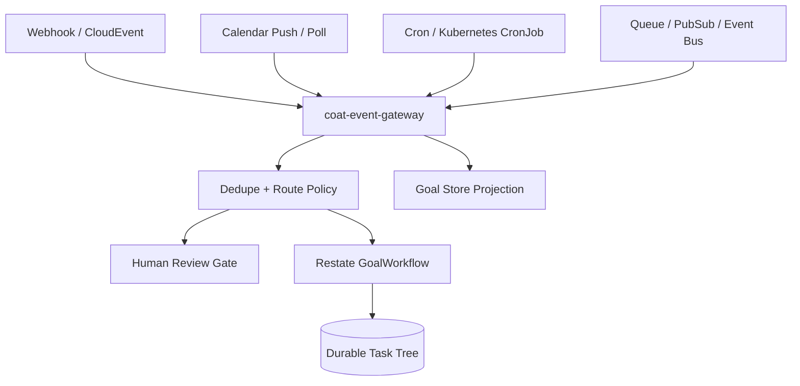

# Design Doc: Events, Webhooks, Calendars, And Schedules

External events should not call worker agents directly. They enter through `coat-event-gateway`, become normalized events with dedupe keys, and then create or steer durable goals through Restate.

## Decision

Use standard event and schedule shapes:

- CloudEvents-compatible metadata for webhook and bus events.
- AsyncAPI for documenting event-driven APIs; the current contract lives at `docs/api/event-gateway.asyncapi.yaml`.
- Kubernetes CronJobs for cluster-native scheduled trigger jobs.
- Restate timers and workflows for durable waits, retries, approval pauses, and follow-up scheduling inside a running goal.
- Provider-specific push APIs for calendars where available, plus bounded polling for calendar windows and missed notifications.

`coat-event-gateway` is the local ingress service. It records event sources, raw events, and triggered-goal decisions in an append-only JSONL journal for development. Production should store event inbox records in Postgres and optionally forward high-volume topics through Kafka, Redpanda, NATS, SQS/SNS, Pub/Sub, EventBridge, or another existing event bus. The Postgres inbox/outbox schema is scaffolded in `infra/db/migrations/002_event_gateway.sql`.

## Topology

## Contracts

Core domain types:

- `EventSource`
- `WebhookEventSource`
- `ScheduledEventSource`
- `CalendarEventSource`
- `ExternalEvent`
- `EventGoalRoute`
- `GoalTriggerTemplate`
- `TriggeredGoalRequest`
- `TriggeredGoalResponse`

Proto definitions live in `proto/coat/v1/eventing.proto`.

`EventGoalRoute.mode` decides whether an event is recorded only, creates a goal, creates a research goal, steers an existing goal, or waits for human review. Routes must carry dedupe windows and may require approval.

## Webhook Rules

Webhook handlers should:

- verify gateway auth before recording or triggering work;
- verify source auth through `WebhookAuthPolicy`;
- support shared-secret headers, bearer tokens, and HMAC-SHA256 signatures with secret values resolved from `SecretRef`;
- terminate production-only mTLS or OIDC JWT flows at trusted ingress or secret middleware until a provider adapter is installed;
- normalize headers and payload into `ExternalEvent`;
- preserve provider delivery IDs as `dedupe_key`;
- never put raw shared secrets into event payloads, diagnostics, goal JSON, artifacts, or memory;
- create goals only through the event gateway and Restate ingress.

Provider-specific webhook adapters should map delivery metadata into CloudEvents-style fields: `id`, `source_id`, `event_type`, `subject`, `occurred_at`, and payload.

## Calendar And Scheduled Work

Calendar checks are event sources, not hidden loops inside workers.

Use this pattern:

1. A Kubernetes CronJob, Restate timer, or small scheduler calls the event gateway.
2. The gateway records a calendar-window event.
3. A route either creates a planning/research goal or requests human review.
4. The goal runs through normal task distribution, approval, memory, research, and validation.

The example cluster schedule is `infra/k8s/examples/calendar-trigger-cronjob.yaml`; it is suspended by default so operators must explicitly activate it after source, route, and auth review.

For Google Calendar or Outlook:

- use provider push notifications where reliable and configured;
- keep sync tokens and OAuth/session material in `SecretRef` or workload identity;
- do bounded polling with `lookahead_seconds` and `poll_interval_seconds` when push notifications are not enough;
- emit a durable event for each actionable calendar window, not for every raw provider notification.

## Cron And Event Loops

Use three layers:

- Cluster schedules: Kubernetes CronJobs for detached scheduled triggers.
- Durable waits: Restate timers and workflow state for "wake this goal later" behavior.
- Operator automations: local Codex thread heartbeats/reminders only when the request is specifically about this interactive thread.

Do not create a long-lived agent process that sleeps and wakes itself forever. Every wakeup must become an `ExternalEvent`, `TriggeredGoalRequest`, steering directive, or bounded task.

## Agent-Generated Topologies

Agents may propose new event sources, routes, goals, or schedules, but they do not activate them directly. They return structured child requests or artifacts. The coordinator or a human-approved operations task installs the event source.

This allows dynamic topologies while preserving auditability:

- an incident reviewer can propose a follow-up monitor;
- a research agent can propose weekly source refreshes;
- a release unifier can propose post-release health checks;
- a calendar assistant can propose a recurring planning goal.

Activation requires policy validation and, for webhooks, external callbacks, calendar auth, or schedule creation, human approval by default.

Set `COAT_REQUIRE_EVENT_SOURCE_APPROVAL=true` in production-like environments. When enabled, `coat-event-gateway` rejects activation of risky enabled sources unless the registration request includes `x-coat-approval-id`; `coat event register --approval-id ...` sets that header. Operators can still register the source disabled first and activate it after review.
